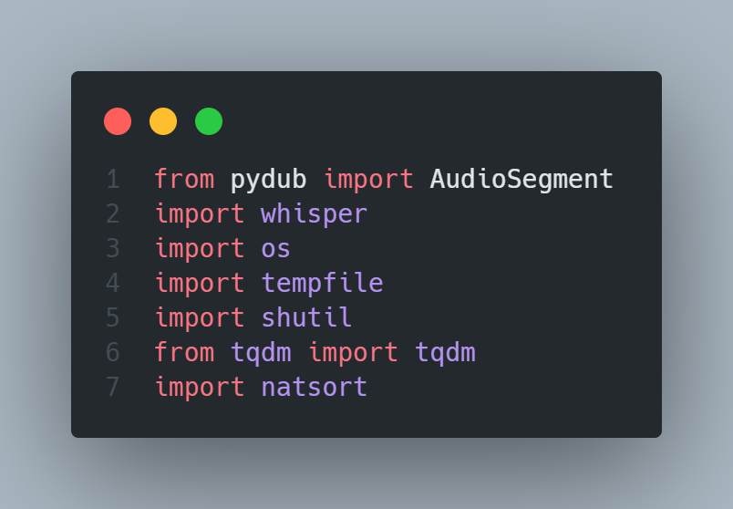
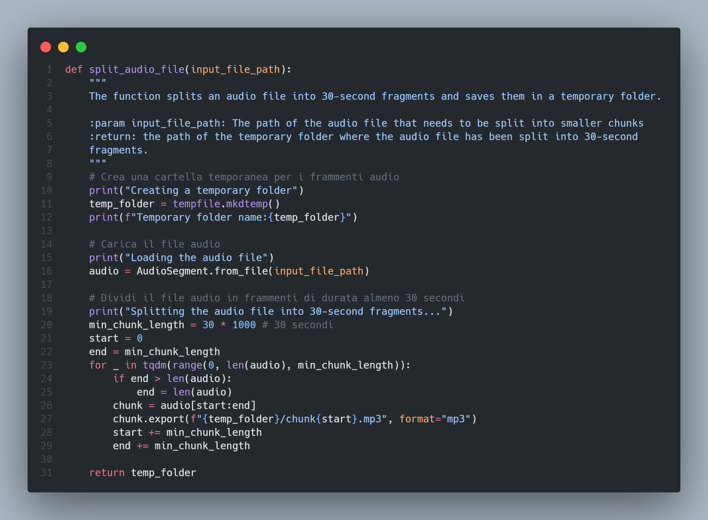
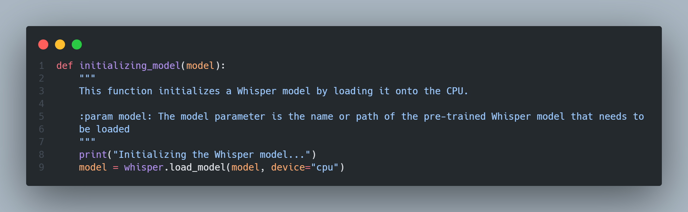
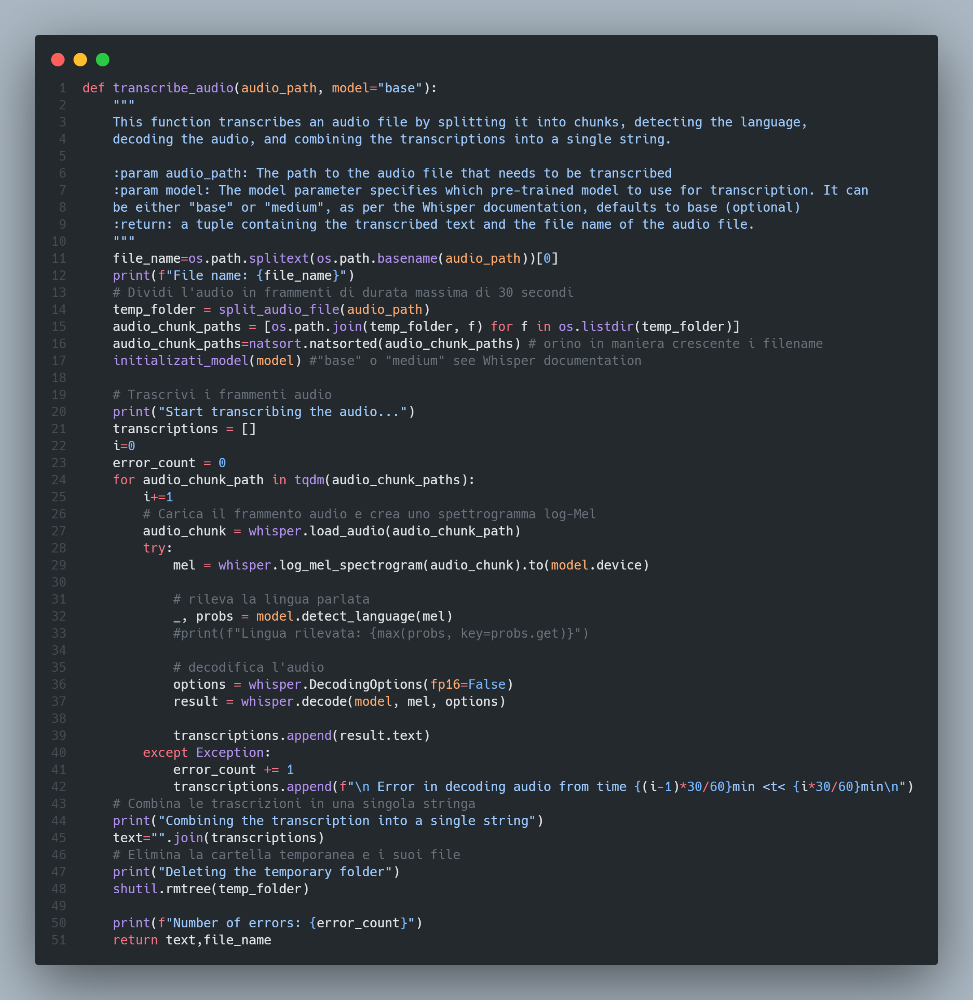
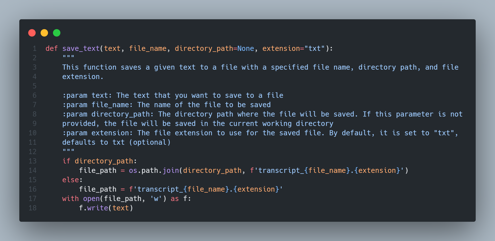

# Transcriptor
## English
It is a Python script that uses Whisper AI to generate the transcription of the audio file that is given as input. It can be used both from the terminal and as a Python module.

It is based on the Whisper library which you can find at the link: https://github.com/openai/whisper and takes inspiration from the video by G-Program-It: https://www.youtube.com/watch?v=E0_kG5j6lEo&t=1121s&ab_channel=G-Program-It.

In particular, the code uses the ‘pydub’ library to split an audio file into 30-second fragments and the ‘whisper’ library to transcribe each fragment. The code defines three main functions: ‘split_audio_file’, ‘transcribe_audio’ and ‘save_text’. The ‘split_audio_file’ function splits an audio file into 30-second fragments and saves them in a temporary folder. The ‘transcribe_audio’ function loads the audio fragments from the temporary folder, transcribes them using the Whisper model and combines the transcriptions into a single string. Finally, the ‘save_text’ function saves the transcription to a text file.

### Code description
Here’s a step-by-step explanation of the code:

1. The code starts by importing the necessary libraries: pydub, whisper, os, tempfile, shutil, tqdm, and natsort.
   
2. The split_audio_file function is defined. This function takes an input file path as an argument and splits the audio file into 30-second fragments.
   
   1. A temporary folder is created to store the audio fragments.
   2. The audio file is loaded using the AudioSegment.from_file method from the pydub library.
   3. The audio file is split into 30-second fragments using a for loop. Each fragment is exported as an mp3 file and saved in the temporary folder.
   4. The function returns the path to the temporary folder.
3. The whisper model is initialized using the whisper.load_model method.
   
4. The transcribe_audio function is defined. This function takes an audio file path as an argument and transcribes the audio using the whisper library.
   
5. The audio file is split into 30-second fragments using the previously defined split_audio_file function.
   1. The audio fragment paths are sorted in ascending order using the natsort.natsorted method.
   2. A for loop is used to iterate over each audio fragment path. For each fragment:
      1. The audio fragment is loaded using the whisper.load_audio method and a log-Mel spectrogram is created using the whisper.log_mel_spectrogram method.
      2. The language of the audio fragment is detected using the model.detect_language method.
      3. The audio fragment is decoded (i.e., transcribed) using the whisper.decode method and the transcription is appended to a list of transcriptions.
      4. If an error occurs during decoding, an error message is appended to the list of transcriptions instead.
   3. The transcriptions are combined into a single string using the .join() method on the list of transcriptions.
   4. The temporary folder and its files are deleted using the shutil.rmtree method.
   5. The function returns the transcription text and file name.
6. The save_text function is defined. This function takes text, a file name, an optional directory path, and an optional file extension as arguments and saves the text to a file with the specified name, directory, and extension.
   

## Italian
È uno script in Python che sfrutta Whiper AI per generare la trascrizione del file audio che si da in ingresso. Può essere usato sia da terminale che come modulo Python.

Si basa sulla libreria Whisper che potete trovare al link: https://github.com/openai/whisper e prende ispirazione dal video di G-Program-It: https://www.youtube.com/watch?v=E0_kG5j6lEo&t=1121s&ab_channel=G-Program-It.

In particolare il codice utilizza la libreria 'pydub' per dividere un file audio in frammenti di 30 secondi e la libreria 'whisper' per trascrivere ogni frammento. Il codice definisce tre funzioni principali: 'split_audio_file', 'transcribe_audio' e 'save_text'. La funzione 'split_audio_file' divide un file audio in frammenti di 30 secondi e li salva in una cartella temporanea. La funzione 'transcribe_audio' carica i frammenti audio dalla cartella temporanea, li trascrive utilizzando il modello *Whisper* e combina le trascrizioni in una singola stringa. Infine, la funzione 'save_text' salva la trascrizione in un file di testo.
